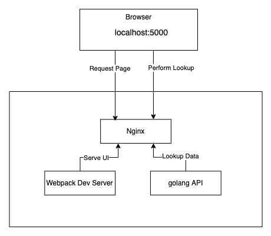
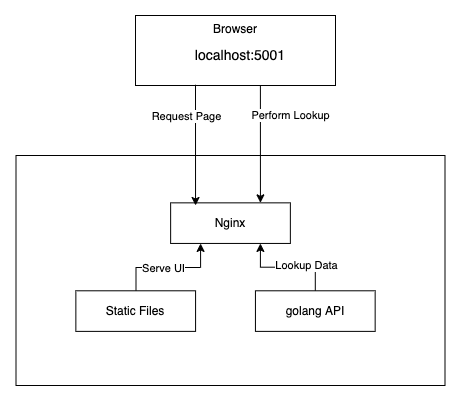

## dns-lookup-service

### Dev Setup

```
git clone git@github.com:philip1986/dns-lookup-service.git
cd dns-lookup-service
docker-compose up --build
```

- Load the app in browser by opening: http://localhost:5000/
- Client side changes are reflected immediately via webpack hot-reload

- Test backend api via curl: 
```
curl 'http://localhost:5000/api/v1/lookup/domain/tesla.com/recordtype/A?nserver=default'  
```
- after backend changes the golang server needs to be re-build and restarted. Just stop and re-run `docker-compose up --build`




### Prod Setup

```
docker-compose -f docker-compose.prod.yml up -d --build
```

- The assets will be build in production mode (minified) and bundled as static files.
- Static file serving is done by Nginx





### Main dependencies 
- Backend Web framework: https://github.com/gin-gonic/gin
- DNS library which offers more functionality than golang `net` package: https://github.com/miekg/dns
- React as client side rendering framework: https://reactjs.org/
- material-ui for React: https://github.com/mui-org/material-ui

### Todos
1. Adding front end tests 
2. Adding E2E tests via headless browser
3. Extending backend test coverage
4. Polishing up the UI


